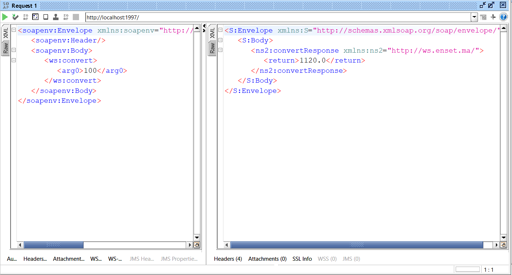
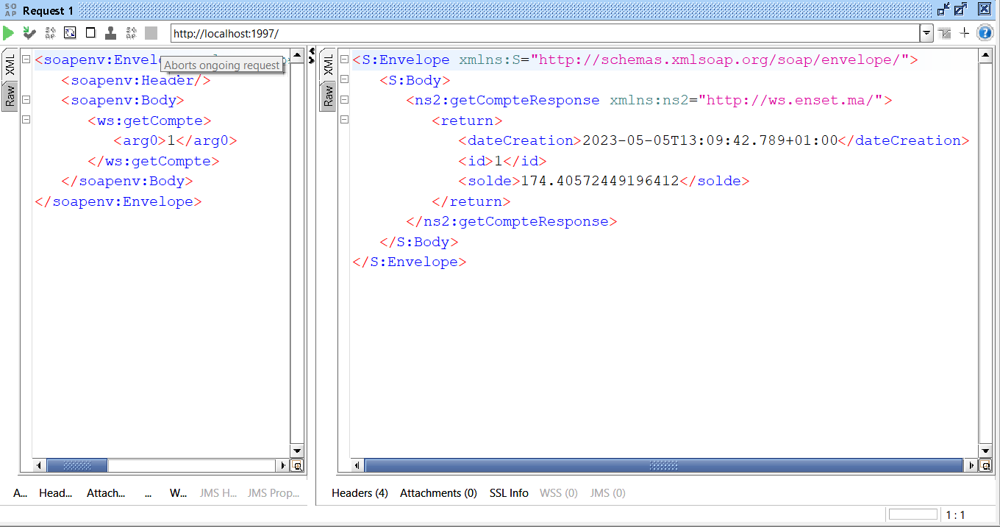
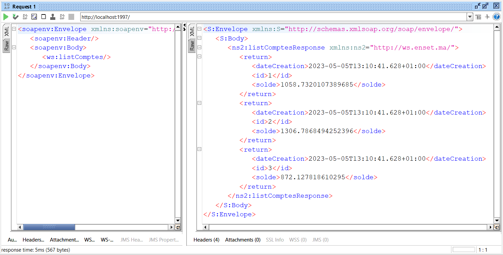
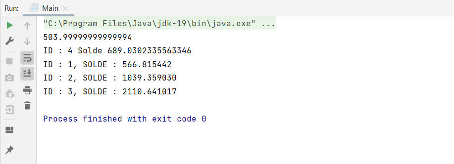

<h3>Activité Pratique N°2 : Web services</h3>

<h5>1. Consultaion du wsdl sur browser</h5>

<h5>2. Consultaion du schema XML</h5>

<h5>2. Test du web service avec SOAPUI</h5>
<h6>Methode convert() : </h6>

<h6>Methode getCompte() : </h6>

<h6>Methode listComptes() : </h6>

<h5>3. Test du web service avec un client JAVA</h5>
